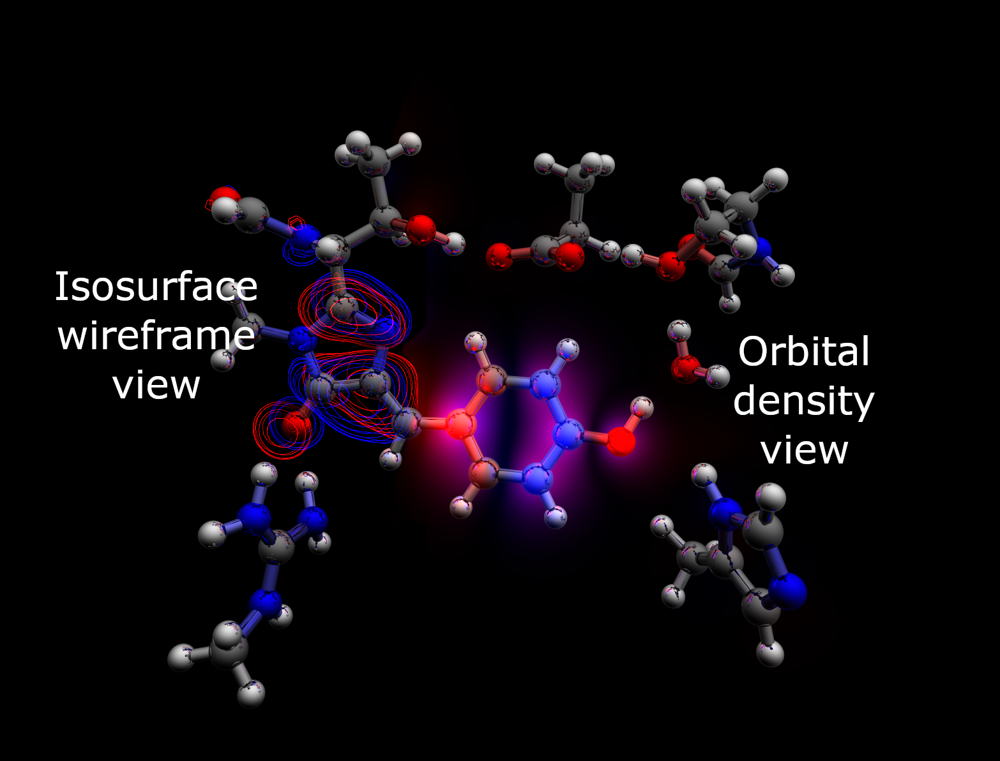

# 3D Molecular Orbital Visualiser

A ray-tracing experiment to visualise molecules and their orbitals using Gaussian's .cub files. 

## Volumetric density and molecular visualisation

Supports .cub files for density visualisation, but start with small files and coarse grids before attempting to visualise large molecules!

Also supports .gjf and .com (Gaussian input files) for simple molecular visualisation.

## Controls

Left-click drag : Orbit camera around molecule

Right-click drag : Pan camera

Scroll : Zoom camera

Space : Stop motion

+/- : Change orbital intensity

Shift and +/- : Change iso level

\[/\] : Change shadow cone angle

Shift + Left-click drag : Orbit lighting around molecule

I : Toggle isosurface

G : Toggle ground plane

H : Toggle hydrogen bonds

## Credits

Thanks go to David Kuri (Read his [blog](http://blog.three-eyed-games.com/2018/05/03/gpu-ray-tracing-in-unity-part-1/) on ray tracing) and Sebastian Lague ( [GitHub](https://github.com/SebLague/Clouds) ).